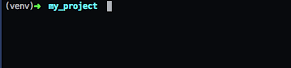

Object Detection API
====================
1. [Create virtual environment](#creat-virtualenv)
2. [Data preparing](#data-preparing)
3. [Object detection API installation](#installation)
4. [Test our model](#test-our-model)
5. [How to train](#helper-codes)


# 1. Create virtualenv
1. If you don't have python 3
    ```python
    # Check python version
    python -V
    # Check if python3 already installed
    python3 -V
    # intall python3 with brew
    brew install python3
    ```
2. Install python Virtualenv library
    ```
    pip3 install virtualenv
    ```
3. Create a new python virtual environment
    ```
    virtualenv -p [python_path] [env_name]
    ```
4. How to activate created virtual environment
    ```
    source [path_to_virtualenv]/bin/activate
    ```

    If virtual environment is activated, it looks like below the image

    
5. If you want to deactivate environment
    ```
    deactivate
    ```

# 2. Data preparing
1. Download Image annotation LabelImg tool
    ```
    git clone https://github.com/tzutalin/labelImg.git
    ```
2. Activate your virtual environment
    ```bash
    source [path_to_virtualenv]/bin/activate
    ```
3. LabelImage dependencies
    ```bash
    pip install PyQt5 lxml
    cd labelImg
    make qt5py3
    ```
4. run labelImg
    ```
    python labelImg.py
    ```

>If you want to know more about labelImg hotkey or other options [click here](https://github.com/tzutalin/labelImg)

# 3. Object detection API installation
### Dependencies
    * Protobuf 3+
    * Python-tk
    * Pillow 1.0
    * lxml
    * tf Slim (which is included in the "models/research/" * checkout)
    * Jupyter notebook
    * Matplotlib
    * Tensorflow
    * Cython
    * cocoapi

1. Install Tensorflow & other python library
    ```python
    pip install pillow
    pip install jupyter
    pip install Cython
    pip install matplotlib
    # For CPU (Any devices)
    pip install tensorflow
    # For GPU (Tensorflow GPU only runs with Nvidia GPUS)
    pip install tensorflow-gpu
    ```
    
    >You have not installed CUDA, cudNN, [See here](cuda_installation.md) installation
2. Clone `models` github respository
    ```
    git clone https://github.com/tensorflow/models.git
    ```
3. COCO API installation
    Download the [cocoapi](https://github.com/cocodataset/cocoapi) and copy the pycocotools subfolder to the tensorflow/models/research directory if you are interested in using COCO evaluation metrics. The default metrics are based on those used in Pascal VOC evaluation. To use the COCO object detection metrics add metrics_set: "coco_detection_metrics" to the eval_config message in the config file. To use the COCO instance segmentation metrics add metrics_set: "coco_mask_metrics" to the eval_config message in the config file.
    ```
    git clone https://github.com/cocodataset/cocoapi.git
    cd cocoapi/PythonAPI
    make
    cp -r pycocotools ../../models/research/
    # to go back to project home directory(in my case, going back twice)
    cd ../..
    ```
3. Protobuf Installation
    
    1. Download source files of protobuf 3.6.0
        
        >wget (Ubuntu)
        ```
        wget https://github.com/google/protobuf/releases/download/v3.6.0/protobuf-all-3.6.0.tar.gz
        ```
        
        >curl (MacOS)
        ```
        curl https://github.com/google/protobuf/releases/download/v3.6.0/protobuf-all-3.6.0.tar.gz
        ```
    2. Install protobuf 3.6.0
        ```
        tar zxfv protobuf-all-3.6.0.tar.gz
        cd protobuf-all-3.6.0
        ./configure
        make
        sudo make install
        ```
4. Protobuf Compilation
    
    The Tensorflow Object Detection API uses Protobufs to configure model and training parameters. Before the framework can be used, the Protobuf libraries must be compiled. This should be done by running the following command from the tensorflow/models/research/ directory:
    ```python
    # From models/research/
    protoc object_detection/protos/*.proto --python_out=.
    ```
5. Add Libraries to PYTHONPATH
    
    When running locally, the tensorflow/models/research/ and slim directories should be appended to PYTHONPATH. This can be done by running the following from tensorflow/models/research/:
    ```python
    # From tensorflow/models/research/
    export PYTHONPATH=$(which python3):`pwd`:`pwd`/slim
    ```
    
    >Note: This command needs to run from every new terminal you start. If you wish to avoid running this manually, you can add it as a new line to the end of your `~/.bashrc` or `<virtualenv/bin/activate>` file, replacing `\'pwd'` with the absolute path of tensorflow/models/research on your system, If you use virtualenv deactivate your virtualenv before to add PYTHONPATH. Then reactivate your virtual environment.
6. Testing the Installation
    
    You can test that you have correctly installed the Tensorflow Object Detection
API by running the following command:

    ```
    python object_detection/builders/model_builder_test.py
    ```


# 4. Test our model

We trained company names on Object Detection API using Faster RCNN Inception Resnet v2 model for 200k step
    

    
    jupyter notebook test.ipynb     
    


[See code](example/test.ipynb)


# 5. How to train (Helper codes)


>First you need to label all images with labelImg, then it looks like the below image

```
├── images
    ├── Class1
    │   ├── image1.JPG          
    │   ├── image1.xml          # Label data of image1.JPG
    │   ├── image2.JPG          
    │   ├── image2.xml          # Label data of image2.JPG
    │   ├── .
    │   ├── .
    │   ├── .
    │   ├── imageN.JPG 
    │   └── imageN.xml
    ├── Class2
    │   ├── image1.JPG          
    │   ├── image1.xml          # Label data of image1.JPG
    │   ├── image2.JPG          
    │   ├── image2.xml          # Label data of image2.JPG
    │   ├── .
    │   ├── .
    │   ├── .
    │   ├── imageN.JPG 
    │   └── imageN.xml
    ├── .
    ├── .
    ├── .
    └── ClassN
    
```

1. If your images is so large size to train, there are two options to resolve it. First is resizing images with keep annotations, Last one is crop only label existing coordinates. 
    
    >`That two options will remove orginal images. Therefore be ware to lost your labelled data.`

    * Option 1. Resize all images
        ```bash
        # Resizing images from given folder
        python resize_images.py [images_folder] [max_size]
        # example
        python resize_images.py images/Class1 2048
        ```
    * Option 2. Crop images
        ```python
        # Crop all images
        python crop_images.py [images_folder] [max_size]
        # example
        python crop_images.py images/Class1 2048
        ```
    >[max_size] default value is 2048px

2. Split all data of `each classes` by given proportion into `final_data/train`, `final_data/test`

    ```bash
    python split_images.py [path_contains_data_of_all_classes] [train_images_proportion]
    #example data of each classes will be splitted 80% into train, left 20% into test

    python split_images.py  images/ 80
    ```
    
    >`[train_images_proportion]` is how many images to train from total images and value range 1 - 100%,`[train_images_proportion]` default value is 80.


    If you run the code, `final_data` directory automatically  will be created.

    ```
    ├── final_data
        ├── test # 20% data of each classes
        │   ├── image1.JPG          
        │   ├── image1.xml          # Label data of image1.JPG
        │   ├── image2.JPG          
        │   ├── image2.xml          # Label data of image2.JPG
        │   ├── .
        │   ├── .
        │   ├── .
        │   ├── imageN.JPG 
        │   └── imageN.xml
        └── train # 80% data of each classes      
            ├── image1.JPG          
            ├── image1.xml          # Label data of image1.JPG
            ├── image2.JPG          
            ├── image2.xml          # Label data of image2.JPG
            ├── .
            ├── .
            ├── .
            ├── imageN.JPG 
            └── imageN.xml
    ```

3. Create label map and change Japanese label to English by using custom dictionary from `final_data` directory
    ```
    python modify_labels.py [dictionary_path]
    ```
    
    >Output will be in data folder.

    ```
    ├── data
        ├── object-detection.pbtxt          # label map
        └── objects.json                    # label map need for xml to csv 
    ├── images
    ├── final_data
    ```

4. XML to csv

    ```bash
    python xml_to_csv.py [images_folder]
    # example output will be created test_labels.csv, train_labels.csv in data folder (data/test_labels.csv, data/train_labels.csv)
    python xml_to_csv.py final_data
    ```

    >It automatically generates csv file from your splitted train, test folders

    ```
    ├── data
        ├── test_labels.csv          # test dataset
        ├── train_labels.csv         # train dataset
        ├── object-detection.pbtxt          # label map
        └── objects.json  
    ```


5. Generate TF Records
    
    >Tensorflow requires to read images and labels with annotations, So that code will help you convert to binary file format.
    ```python
    # Generate train.record
    python generate_tfrecord.py --csv_input=data/train_labels.csv --label_ids=data/objects.json --output_path=data/train.record
    # Generate test.record
    python generate_tfrecord.py --csv_input=data/test_labels.csv --label_ids=data/objects.json --output_path=data/test.record
    ```

    >it will looks like, after the run the command

    ```
    ├── data
        ├── test_labels.csv          # test dataset
        ├── train_labels.csv         # train dataset
        ├── object-detection.pbtxt          # label map
        ├── objects.json
        ├── test.record
        └── train.record
    ```

7. Configure and check your config

    [example config here](example/faster_rcnn_inception_resnet_v2_atrous_coco.config)
    
7. Configure your config of model and set hyperparameters
    * fine_tune_checkpoint
    * train_input_reader
        * input_path
        * label_map_path
    * test_input_reader
        * input_path
        * label_map_path
    * num_steps
    * batch
    * data_augmentation_options
7. Train model with you own data

    >Copy `data` folder to `models/research/object_detection/` and run this code
    ```
    python train.py --logtostderr --train_dir=<your_training_dir> --pipeline_config_path=<model_config>
    ```

Extras
------
* [Tensorflow detection model zoo](https://github.com/tensorflow/models/blob/master/research/object_detection/g3doc/detection_model_zoo.md)
* [Exporting a trained model for inference](https://github.com/tensorflow/models/blob/master/research/object_detection/g3doc/exporting_models.md)
* [Defining your own model architecture](https://github.com/tensorflow/models/blob/master/research/object_detection/g3doc/defining_your_own_model.md)
* [Bringing in your own dataset](https://github.com/tensorflow/models/blob/master/research/object_detection/g3doc/using_your_own_dataset.md)
* [Supported object detection evaluation protocols](https://github.com/tensorflow/models/blob/master/research/object_detection/g3doc/evaluation_protocols.md)
* [Inference and evaluation on the Open Images dataset](https://github.com/tensorflow/models/blob/master/research/object_detection/g3doc/oid_inference_and_evaluation.md)
* [Run an instance segmentation model](https://github.com/tensorflow/models/blob/master/research/object_detection/g3doc/instance_segmentation.md)
